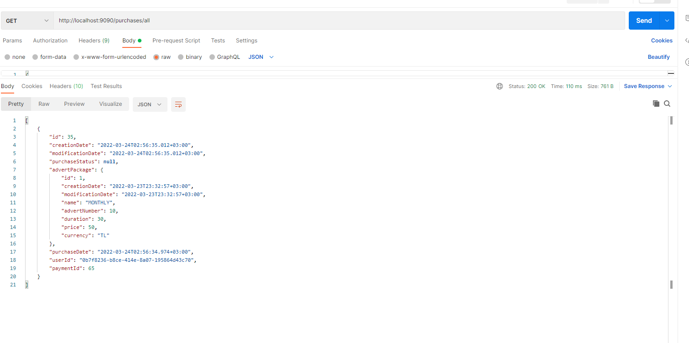

## EMLAK BURADA


## Yükleme

Local ortamda çalıştırma

```bash 
  git clone https://github.com/halimeozturk/Patika-HepsiEmlak-Graduation
  cd Patika-HepsiEmlak-Graduation
```

### 1.Gateway Servis
```bash 
  cd api-gateway
  mvn spring-boot:run
```

### 2.Auth Servis
```bash 
  cd user
  mvn spring-boot:run
```

### 3.Advert Servis
```bash 
  cd advert
  mvn spring-boot:run
```

### 4.Payment Servis
```bash 
  cd payment
  mvn spring-boot:run
```

### 5.Purchase Servis
```bash 
  cd purchase
  mvn spring-boot:run
```

### 6.Email Servis
```bash 
  cd email
  mvn spring-boot:run
```

### Rabbitmq
```bash 
  docker run -it --rm --name rabbitmq -p 5672:5672 -p 15672:15672 rabbitmq:3.8-management
```

### UML DİYAGRAMI


Toplamda 6 mikroservis kullandım. Sistem akışı şu şekilde;
1) Kullanıcı sisteme kayıt oldu.
2) Kullanıcı sisteme giriş yaptı.
3) Kullanıcı sistemden paket satın aldı.
4) Kullanıcı ilan oluşturdu.
5) Süresi veya paketi bitinceye kadar ilan oluşturabilir.


Payment servisimin içine ödeme sistemi entegre ettim. Ödeme sistemini https://stripe.com veriği test hesabı ile yaptım.Ödemeyi yaptıktan sonra sistemde Payment tablosuna ve Payment Log tablosuna kayıt atıyorum.
Sistem başarılı ise rabbitmq ile Purchase servisine kayıt atıyorum ve tekrar rabbitmq kullanarak email atıyorum.  
Purchase servisimin yapısı şu şekilde.Purchase tablom var genel satın almalarımı görebildigim bir tablo bu.  
Purchase Count tablosu genel satın almalarımı hesaplayan tablo eğer paket hakkım bitmemiş ise ve yeni bir paket alırsam var olan kaydımı günceliyor.  
Örneğin 28.02.2022 tarihinde bir paket satın aldıysam ve içinde 5 tane ilan oluşturma hakkım kaldıysa ve 24.03.2022 de tekrar paket satın aldıysam var olan kaydımın üzerine ekleme yapıyor.Yani toplam 15 ilan hakkım olur.
Eğer ben 28.02.2022 tarihinde bir paket satın aldıysam ve içinde 5 tane ilan oluşturma hakkım kaldıysa ve 30.03.2022 de tekrar paket satın almak istediğimde eski haklarım yanacağı için yeni kayıt atar.  
Purchase servisimin içinde Advert Package var.Paketleri bu tabloda tuttum yeni bir servis oluşturmaya bu aşamada gerek duymadım.
Bu servisler arasında feign client ile haberleştim örneğin user bilgisi var mı yok mu kontrollerini yapmak için feign client kullandım.  
Advert servisinde ilan oluştururken önce user var mı diye kontrol ettim daha sonra ilan hakkım ve sürem bitmiş mi diye kontrol ettim. Purchase count içindeki bu method ile getPurchaseCount(UUID id);
İlanları oluşturduğumda durumunu ilk başta IN_REVIEW olarak setledim rabbitmq ile kuyruktan okuyup durumunu ACTİVE'e çektim. Durumunu active ve pasif yapmak için PUT ile update servisine çıkması yeterli burada ayrı ayrı apiler yazmadım update işlemide işimi gördüğü için.
Criteria kullanarak pageable bir listeleme kullandım.Bu listeleme sayesinde durumu aktif ve pasif olanları listeleyebiliyorum istersem bazı alanların filtrelemesinide yapabiliyorum.
Email servisinde template kullandım.

## API Kullanımı

#### ADVERT SERVİS

| Request | Route     | Body                |  RequestParam                | Açıklama                |   
| :-------- | :------- | :------------------------- | :------------------------- |:------------------------- |
| POST | /adverts |     { <br> "title": "deneme",  <br> "description": "Acil Satilik", <br>"putFordward": 100, <br>"currency": "TL", <br>"price": 25000.0, <br>"room": 4, <br>"livingRoom": 1, <br> "age": 1, <br> "bathRoom": 3,"floor": "13", <br>"numberOfFloor": 20, <br>"netSquareMeters": 200.0, <br> "squareMeters": 250.0, <br>"publicationType": "FOR_RENT", <br>"buildType": "TILE_HOUSE", <br>"buildState": "ZERO", <br>"active": true, <br>"roomAndLivingRoom": "4+1", <br>"imageList": [],  <br> "address": { <br>"id": 1, <br>"province": "İstanbul", <br>"district": "Maltepe", <br>"fullAddress": null  <br>}, <br>"mainCategory": null, <br>"subCategory": null  <br>} |  -    | Yeni bir ilan oluşturmamızı sağlar. |
| GET  | /adverts |  -    |  -    | Tüm ilanları sayfalama yapısı olmadan listeler. |
| GET  | /adverts/advertNo/{advertNo} |  -    |  advertNo  | İlan numarasına göre ilanları listeler. |
| GET  | /{id}    |  -    |  -    | İlan id sine göre ilanı çeker. |
| UPDATE | /adverts | { <br> id":"1", <br> "title": "deneme",  <br> "description": "Acil Satilik", <br>"putFordward": 100, <br>"currency": "TL", <br>"price": 25000.0, <br>"room": 4, <br>"livingRoom": 1, <br> "age": 1, <br> "bathRoom": 3,"floor": "13", <br>"numberOfFloor": 20, <br>"netSquareMeters": 200.0, <br> "squareMeters": 250.0, <br>"publicationType": "FOR_RENT", <br>"buildType": "TILE_HOUSE", <br>"buildState": "ZERO", <br>"active": true, <br>"roomAndLivingRoom": "4+1", <br>"imageList": [],  <br> "address": { <br>"id": 1, <br>"province": "İstanbul", <br>"district": "Maltepe", <br>"fullAddress": null  <br>}, <br>"mainCategory": null, <br>"subCategory": null  <br>}    | -    |  İlanı günceller.Aynı zamanda bir ilanı aktif yada pasif yapmak istedigiğimizde bu ilanı kullanmalıyız. |
|  GET | /adverts/filter |  -    | pageable,creationDate,advertNo,currency, <br> price,netSquareMeters,squareMeters,room,<br> livingRoom,age,bathRoom,numberOfFloor,<br> floor,publicationType,buildType,active,<br> roomAndLivingRoom,province,district    |  Tüm ilanları sayfalama yapısına göre listeler bu yapıda aktif ilanları ve pasif ilanları listeleyebiliriz. |


#### PAYMENT SERVİS

| Request | Route     | Body                |  RequestHeader                | Açıklama                |   
| :-------- | :------- | :------------------------- | :------------------------- |:------------------------- |
| POST  | /payment/v1/tokens    |  { <br>"number": "4242424242424242",<br>"exp_month": 3,<br> "exp_year": 2023,<br>"cvc": "314",<br> "amount":50000.0,<br>"advertPackageId":1,<br> "email":"ozturkk.halimee@gmail.com" <br> }   |  userId    | Paket satın alma servisi. |

#### PURCHASE SERVİS

| Request | Route     | Body                | RequestParam/RequestHeader/PathVariable                | Açıklama                |   
| :-------- | :------- | :------------------------- | :------------------------- |:------------------------- |
| POST  | /purchases    |{<br>"purchaseStatus":"APPROVED",<br> "advertPackage":{<br> "name":"MONTHLY",<br> "advertNumber":"10",<br>  "duration":"30",<br> "price":"50",<br> "currency":"TL"<br>},<br> "purchaseDate":"",<br> "userId":"27b3e524-57b8-47bd-ac94-c8dc07c914a3",<br>"paymentId":"1"<br>}   |  userId    |  Ödeme yapıldıktan sonra bu servise çıkıp satın alınan paket tanımlanır.|
| PUT  | /purchases    |{<br>"purchaseStatus":"APPROVED",<br> "advertPackage":{<br> "name":"MONTHLY",<br> "advertNumber":"10",<br>  "duration":"30",<br> "price":"50",<br> "currency":"TL"<br>},<br> "purchaseDate":"",<br> "userId":"27b3e524-57b8-47bd-ac94-c8dc07c914a3",<br>"paymentId":"1"<br>}   |  userId    |  Satın alınmış paketi güncelleme.|
| GET  | /purchases/{id}    |  -    |  (PathVariable) id  | id ile satın alma getirme. |
| GET  | /purchases/all    |  -    | (RequestHeader) userId   | Satın aldığım bütün ilanları getirme . |
| GET  | /purchase-counts/{id}    |  -    | (PathVariable) id  | Satin alınan ilanların toplu sonucunu getirme. Örneğin kalan hak:20 |
| PUT  | /purchase-counts    |  {<br>"startDate":"",<br> "endDate":"",<br>"total":"50",<br>"userId":"27b3e524-57b8-47bd-ac94-c8dc07c914a3",<br> "remainingTotal":"30"<br>}    | -  | Satın alınan ilanların toplamının güncellenmesi.İlan oluştururken bu servise çıkıp kalan haklarımdan eksiltiyorum.|
| GET  | /advert-packages/{id}    |  -    |  (PathVariable) id  | Sisteme tanımlı paketleri id ile getirme. |


#### USER SERVİS

| Request | Route     | Body                | RequestParam/RequestHeader/PathVariable                | Açıklama                |   
| :-------- | :------- | :------------------------- | :------------------------- |:------------------------- |
| GET  | /users   |  -    |  - | Bütün kullanıcıları listeleme. |
| POST  | /users   |  { <br> "userType":"INDIVIDUAL",<br>"firstName":"Halime",<br>"lastName":"Öztürk",<br>"email":"ozturkk.halimee@gmail.com",<br> "password":"12345",<br>"username":"halime"<br>}   |  - | Sisteme kullanıcı kayıt etme. |
| PUT  | /users   |  { <br> "id":1,<br>"userType":"INDIVIDUAL",<br>"firstName":"Halime",<br>"lastName":"Öztürk",<br>"email":"ozturkk.halimee@gmail.com",<br> "password":"12345",<br>"username":"halime"<br>}   |  - | Var olan kullanıcıyı güncelleme. |
| GET  | /users/{id}   |  -    |  (PathVariable) id | id ye göre kullanıcı getirme. |
| GET  | /users/email/{email}   |  -    |  (PathVariable) email | mail bilgisine göre kullanıcı getirme. |
| GET  | /users/exists/{id}   |  -    |  (PathVariable) id | Kullanıcının var olup olmadığını bulur. |
| POST  | /auth   |  {<br>"email": "ozturkk.halimee@gmail.com",<br>"password":"12345"<br>}    |  - | Kullanıların sisteme giriş yapmasını sağlar. |


### Servis Endpointleri

Gateway: http://localhost:9090  
Auth: http://localhost:8085  
User: http://localhost:8085  
Advert: http://localhost:8086  
Email: http://localhost:8099  
Payment: http://localhost:8080  
Purchase: http://localhost:8088  
User: http://localhost:8085  

### Database Bilgileri
Advert Database: http://localhost:5432/advert
User Database: http://localhost:5432/user
Email Database: http://localhost:5432/email
Payment Database: http://localhost:5432/payment
Purchase Database: http://localhost:5432/purchase


## UNIT TEST

### Advert Unite Test Covarage Oranı  
  

### User Unite Test Covarage Oranı
    

### Purchase Unite Test Covarage Oranı
  

### Payment Unite Test Covarage Oranı
  


### Sistemin Çalıştığını Gösteren Postman Ekran Görüntüleri

#### User Postman
  

#### Auth Postman
  

#### Advert eklemeye çalışırken header'a token bilgisi girilmediğinde 401 hatası 


#### Paketi olmayan veya paket tarihi geçmemiş ancak paket hakkı bitmiş kullanıcı ilan eklemeye çalışırsa aşağıdaki hatayı alır.


#### Paket satın alma servisi.


#### Paket satın aldıktan sonra rabbitmq ile email kuyruğuna yazılan veri
 

#### Paket satın aldıktan sonra rabbitmq ile purchase kuyruğuna yazılan veri
 

#### Email servisinin yolladığı mail
 

#### Satın alma işleminden sonra başarılı bir şekilde ilan oluşturabildim
 

#### Satın almalarımı görebiliyorum
 

#### Aktif olarak kullandığım paketlerimin toplamını ve toplam kalan haklarımı görebiliyorum
 

